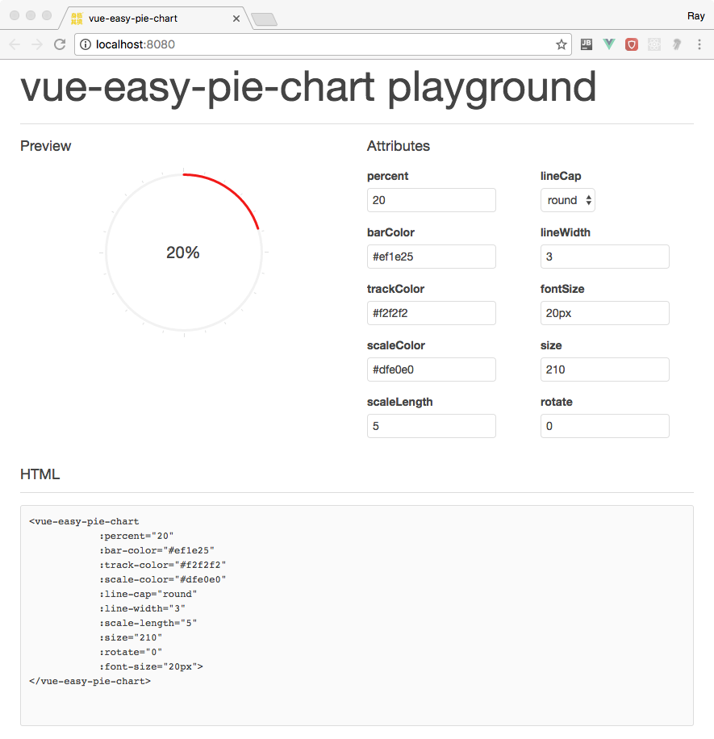

# vue-easy-pie-chart

easy-pie-chart with all power of Vue2.

## Install

```
$ npm i vue-easy-pie-chart -D
```

## Using in Vue

```html
<template>
  <div>
     <vue-easy-pie-chart :percent="30"></vue-easy-pie-chart>
  </div>
</template>
<script>
  import VueEasyPieChart from 'vue-easy-pie-chart'
  import 'vue-easy-pie-chart/dist/vue-easy-pie-chart.css'
  
  export default {
      components:{ VueEasyPieChart }
  }
</script>
```


## Custom the inner text

```html
<vue-easy-pie-chart :percent="30">
  <i class="fa-icon fa-icon-email"></i>
</vue-easy-pie-chart>
```


## Run the playground

Clone this repository to your local and run the following command to start the playground 

```
$ npm run dev
```
  
  


## Properties

Properites (Type) | Default | Description
------------------|---------|------------
`bar-color`| `#ef1e25` | The color of the curcular bar. You can pass either a css valid color string like rgb, rgba hex or string colors. But you can also pass a function that accepts the current percentage as a value to return a dynamically generated color.
`font-size` | `20px`| Set the font size of the inner text
`track-color` | `#f2f2f2` | The color of the track for the bar, false to disable rendering.
`scale-color` | `#dfe0e0` | The color of the scale lines, false to disable rendering.
`line-cap` | `round` | Defines how the ending of the bar line looks like. Possible values are: butt, round and square.
`line-width` | `3` | Width of the bar line in px.
`size`| `110` | Size of the pie chart in px. It will always be a square.
`animate`|`false`|Time in milliseconds for a eased animation of the bar growing, or false to deactivate.

## Events

Event | Description
------|------------
`@start`| Callback function that is called at the start of any animation (only if animate is not false).
`@stop`| Callback function that is called at the end of any animation (only if animate is not false).
`@step`| Callback function that is called during animations providing the current value (the context is the plugin, so you can access the DOM element via this.$el).
